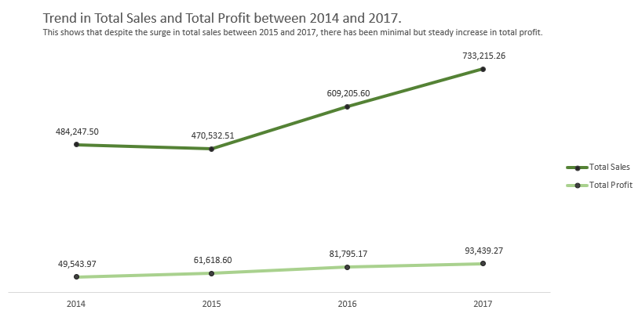

# ARE WE MAKING PROFITS OR RUNNING AT A LOSS?!🤔 : A Comprehensive Analysis of the Sales Data of a Superstore in the United States of America between 2014 and 2017.💵

---
Outline🗂️🗂️🗂️ 
---
1. Overview
2. Data
3. Project Goal
4. Exploratory data analysis
5. Conclusion
---

Overview 🤓
---
In this project, I explored the sales, profit, profit margin and distribution of these key parameters across the different states of the United States of America where the Superstore is located. I also analysed the effect of discounts on the profit margin amongst other indexes to highlight areas of weaknesses and strength in the business. I looked into the customer growth over the years in view.

Data☄️ 
---
The data analyzed contained 9995 rows of data with columns that consisted of the Order ID, 0rder Date, Year, Ship Date, Customer ID,Customer Name, Segment, Country, City, State, Postal Code, Region, Product ID, Category, Sub-category, Product Name, Sales, Quantity Sold, Discount and Profit.

---

Project Goal 🥅
---
The aim of this project is to determine the health of the business and know if they are making profits or losses by studying the sales and profit trend in the Superstore across all the states in the USA. I also aim to identify the poorly performing states in terms of sales and profit and the overall profit margin made per year. This would help to provide insight on strategies to apply and WHERE to apply these strategies. We also identify strategies used in the past to drive sales and the impact on this on sales and profit.

---

Exploratory Data Analysis
---
I explored the trend in total profit between 2014 to 2017. This showed that there was a steady rise in the total profit from $49,543.97 in 2014 to $93,439.27 in 2017 amounting to a 53% increase across these years.

I compared the trend in the total profit and total sales made by the Superstore between 2014 and 2017.

This revealed that despite the jump in sales between 2015 and 2017, the rise in total profit was minimal. This will be revealed better as we compare the profit margin across these years.

This enunciates that inspite of the surge in sales between 2015 to 2017, the profit margin has remained static through these years.

---

To obtain the best and least performing categories and any change in this trend,  
