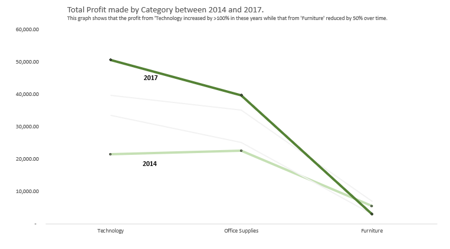
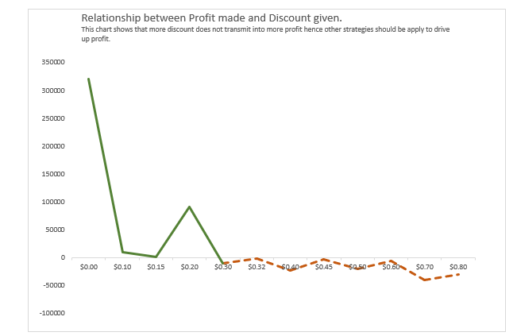

# ARE WE MAKING PROFITS OR RUNNING AT A LOSS?!🤔 : A Comprehensive Analysis of the Sales Data of a Superstore in the United States of America between 2014 and 2017.💵

---
Outline🗂️🗂️🗂️ 
---
1. Overview
2. Data
3. Project Goal
4. Exploratory data analysis
5. Conclusion
---

Overview 🤓
---
In this project, I explored the sales, profit, profit margin and distribution of these key parameters across the different states of the United States of America where the Superstore is located. I also analysed the effect of discounts on the profit margin amongst other indexes to highlight areas of weaknesses and strength in the business. I looked into the customer growth over the years in view.

Data☄️ 
---
The data analyzed contained 9995 rows of data with columns that consisted of the Order ID, 0rder Date, Year, Ship Date, Customer ID,Customer Name, Segment, Country, City, State, Postal Code, Region, Product ID, Category, Sub-category, Product Name, Sales, Quantity Sold, Discount and Profit.

---

Project Goal 🥅
---
The aim of this project is to determine the health of the business and know if they are making profits or losses by studying the sales and profit trend in the Superstore across all the states in the USA. I also aim to identify the poorly performing states in terms of sales and profit and the overall profit margin made per year. This would help to provide insight on strategies to apply and WHERE to apply these strategies. We also identify strategies used in the past to drive sales and the impact on this on sales and profit.

---

Exploratory Data Analysis📈 

---
I explored the trend in total profit between 2014 to 2017. This showed that there was a steady rise in the total profit from $49,543.97 in 2014 to $93,439.27 in 2017 amounting to a 53% increase across these years. This was done with the Microsoft Excel Pivot function.

  

---

I compared the trend in the total profit and total sales made by the Superstore between 2014 and 2017. This was done with the Microsoft Excel Pivot function.

This revealed that despite the jump in sales between 2015 and 2017, the rise in total profit was minimal. This will be revealed better as we compare the profit margin across these years.

This enunciates that inspite of the surge in sales between 2015 to 2017, the profit margin has remained static through these years.

---

To obtain the best and least performing categories and any change in this trend, I compared the Total Sales for the different categories from 2014 to 2017 and then the Total Profit. This was done with the Microsoft Excel Pivot function.

This showed that Technology Category maintained the highest sales from 2014 to 2017 except in 2015 when its sales was over-ridden by the Furniture category. There was an overall rise in sales in all the categories, however, the Furniture category made the least sales in 2017 as against Office Supplies in 2014.

In comparing the trend in the Total profit across the main categories,

Technology made the most profit with an over 100% rise from 2014 to 2017 while Furniture made the least profit in 2017 which was even lower than the profit in 2014.

---

After establishing the fact that Technology is the most profitable Category in 2017, I dug deeper to know which Sub-category in Technology made the most profit. This would help in making procurement decisions.

Copiers made the most profit whilst machines made the least profit.

Furnitures made the least profit overall and losses were made in the Tables and Bookcases subcategory.

In analyzing the Segment that made the most profit, it was discovered that Consumers netted in the most profit at $134,119. This was done using the Microsoft Excel Pivot function.

This shows that more strategies need to be implemented to boost the sales and profit amongst the Home Office and Corporate segments. It also implies that the Consumer directed actions are yielding fruits.

Discounts were given in some instances to boost sales. I studied the effect of Discounts on Total Profit.

This shows that giving Discounts is not a viable plan in the Superstore as instances where it was not given made more Profits. In fact, areas where NO discount was given had the HIGHEST profits.
